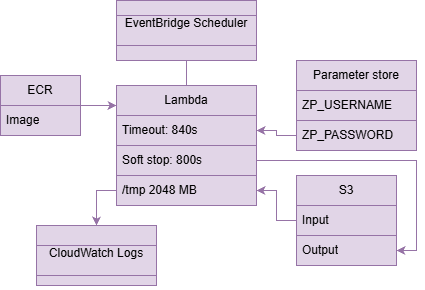

# ZwiftPower → Excel Updater

Narzędzie w Pythonie, które automatycznie uzupełnia plik Excel (`team.xlsx`) o dane z profili ZwiftPower:

- **Weight (kg)**
- **zFTP (W)**
- **Power 15s / 1min / 5min / 20min (W)**

Skrypt loguje się przez Zwift SSO, pobiera dane ze strony profilu i zapisuje wyniki do nowego pliku Excel.

Projekt można uruchamiać zarówno **lokalnie**, jak i w **kontenerze Docker**.

> ⚠️ Używaj zgodnie z regulaminem serwisu oraz tylko do legalnych celów (np. własne dane / zgoda zespołu).

---

## Quick start

### Uruchomienie lokalne
1. Sklonuj repozytorium
2. Skopiuj `.env.example` do `.env` i uzupełnij dane logowania
3. Przygotuj plik `team.xlsx`
4. Uruchom:

```bash
python main.py --headless
```

### Uruchomienie przez Docker
```bash
docker compose run --rm --build zp-updater
```

Po zakończeniu skrypt zapisze plik `updated_team.xlsx`.

---

## Cel projektu

Projekt został stworzony w celu automatyzacji procesu zbierania i aktualizacji danych zawodników z serwisu ZwiftPower, tak aby ułatwić zarządzanie teamem oraz przygotowanie aktualnego arkusza z danymi zawodników.

W praktyce skrypt:

- pobiera dane wszystkich członków teamu z listy w Excelu,
- zbiera je w jednym uporządkowanym pliku,
- eliminuje ręczne przepisywanie danych,
- przyspiesza pracę kapitanów i managerów zespołu,
- ułatwia analizę i porównywanie zawodników.

Dzięki temu zamiast ręcznie odwiedzać profile jeden po drugim, można szybko przygotować aktualny arkusz z najważniejszymi danymi całego zespołu.

---

## Dokumentacja

Szczegółowe informacje zostały rozdzielone do osobnych plików:

- konfiguracja: `docs/configuration.md`
- uruchamianie: `docs/usage.md`
- najczęstsze problemy: `docs/troubleshooting.md`
- szkic architektury AWS: `docs/architecture/lambda-v1.png`
- notatka architektoniczna: `docs/architecture/lambda-v1.md`

---

## Wymagania

### Uruchomienie lokalne
- Python **3.10+**
- Google Chrome (zainstalowany lokalnie)
- Konto Zwift / ZwiftPower (login i hasło)

### Uruchomienie przez Docker
- Docker
- Docker Compose
- Konto Zwift / ZwiftPower (login i hasło)

---

## Struktura projektu

```text
.
├─ .github/
│  └─ workflows/
│     ├─ ci.yml
│     └─ publish-dockerhub.yml
├─ docs/
│  ├─ configuration.md
│  ├─ usage.md
│  ├─ troubleshooting.md
│  └─ architecture/
│     ├─ lambda-v1.drawio
│     ├─ lambda-v1.md
│     └─ lambda-v1.png
├─ tests/
│  ├─ test_cli_help.py
│  ├─ test_config.py
│  ├─ test_excel_io.py
│  └─ test_imports.py
├─ zp_updater/
│  ├─ __init__.py
│  ├─ config.py
│  ├─ excel_io.py
│  ├─ logging_utils.py
│  └─ scraper.py
├─ .dockerignore
├─ .env.example
├─ .gitignore
├─ Dockerfile
├─ README.md
├─ compose.yml
├─ main.py
├─ requirements.txt
└─ team.xlsx
```

---

## Architektura AWS (wstępny szkic)



- źródło diagramu: `docs/architecture/lambda-v1.drawio`
- notatka architektoniczna: `docs/architecture/lambda-v1.md`

Założenia:
- obraz kontenera przechowywany w ECR
- zadanie uruchamiane przez EventBridge Scheduler
- plik wejściowy i wyjściowy przechowywane w S3
- dane logowania przechowywane w Parameter Store
- logi trafiają do CloudWatch Logs

---

## Technologie

### Aplikacja
Python, Pandas, Selenium, BeautifulSoup4, python-dotenv, openpyxl

### Uruchamianie i dostarczanie
Docker, Docker Compose, GitHub Actions, Docker Hub

### Testy
pytest

### Planowana / projektowana warstwa chmurowa
AWS Lambda, Amazon ECR, Amazon S3, Amazon EventBridge Scheduler, AWS Systems Manager Parameter Store, Amazon CloudWatch Logs, Terraform

---

## Roadmap / Dalszy rozwój

Obecna wersja projektu działa zarówno lokalnie, jak i w kontenerze Docker. Kolejne kroki obejmują rozwój infrastruktury, uruchamianie w AWS oraz dalsze rozszerzanie możliwości eksportu danych.

Planowane kierunki rozwoju:

- [x] Dodanie `Dockerfile` do uruchamiania aplikacji w kontenerze
- [x] Przygotowanie obrazu zawierającego wszystkie wymagane zależności (`Python`, `Selenium`, `Chrome/Chromium`)
- [x] Dodanie `.env.example` jako szablonu konfiguracji
- [x] Dodanie `compose.yml` do wygodnego uruchamiania projektu przez Docker Compose
- [x] Uporządkowanie konfiguracji i walidacji wejścia pod bardziej bezobsługowe uruchamianie
- [x] Dodanie podstawowych testów smoke (importy, CLI)
- [x] Dodanie testów dla modułów niezależnych od Selenium
- [x] Rozbudowa walidacji pliku wejściowego i komunikatów błędów
- [x] Dodanie prostego workflow CI (GitHub Actions: test / build obrazu)
- [x] Automatyczna publikacja obrazu na Docker Hub (GitHub Actions)
- [ ] Przygotowanie infrastruktury jako kodu (Terraform)
- [ ] Weryfikacja uruchamiania projektu w AWS (np. jako zadanie uruchamiane okresowo)